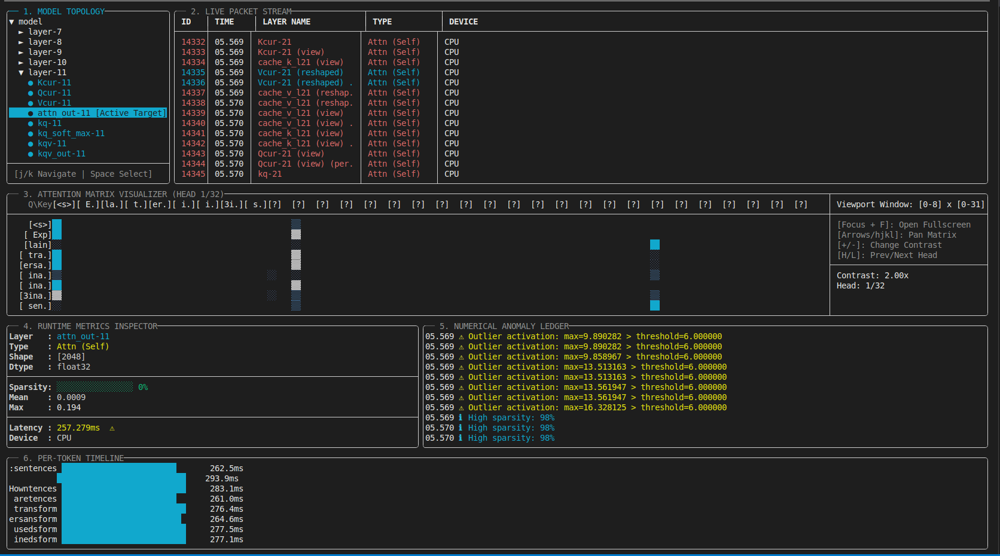

# llamaprobe

A C++17 real-time diagnostic tool that non-invasively hooks into local LLM inference via **llama.cpp**, captures intermediate tensor states (activations, attention weights, layer latencies, anomalies, per-token timing), and presents everything in a live **6-panel interactive terminal UI**.

[](https://github.com/atharv-pdarshi/llamaprobe/actions/workflows/build.yml)
[](https://en.cppreference.com/w/cpp/17)
[](#build)
[](https://github.com/ggml-org/llama.cpp)
[](LICENSE)

```
 llamaprobe | 0.8 tok/s | packets: 4788  anomalies: 12   [Tab] Focus  [?] Help  [Q] Quit
──────────────────────────────────────────────────────────────────────────────────────────
┌── 1. MODEL TOPOLOGY ──────────┐┌── 2. LIVE PACKET STREAM ──────────────────────────────┐
│ ▼ tinyllama                   ││  ID    │ TIME    │ LAYER NAME           │ TYPE         │
│   ● embedding                 ││  4781  │ 25.28   │ ffn_swiglu-7         │ MLP (SwiGLU) │
│   ▼ layer-0                   ││  4782  │ 25.29   │ ffn_out-7            │ MLP (SwiGLU) │
│     ● Qcur-0  [Attention]     ││  4783  │ 25.30   │ norm-8               │ LayerNorm    │
│     ● Kcur-0  [Attention]     ││  4784  │ 25.31   │ Qcur-8               │ Attn (Self)  │
│     ● ffn_inp-0  [MLP]        ││  4785  │ 25.32   │ Kcur-8               │ Attn (Self)  │
│   ▼ layer-1                   │└──────────────────────────────────────────────────────────┘
│     ● Qcur-1  [Attention]     │┌── 3. ATTENTION MATRIX VISUALIZER (HEAD 1/32) ──────────────────────────┐
│  [j/k Navigate | Space Select]││ Q\Key [<s>] [Exp] [lain] [the] [tra.]   Viewport: [0-8] x [0-9]       │
└───────────────────────────────││ [<s>]  ██    ░░    ░░     ░░    ░░     [Focus+F]: Fullscreen            │
┌── 4. RUNTIME METRICS ─────────││ [Exp]  ▒▒    ██    ░░     ░░    ░░     [hjkl]: Pan  [H/L]: Head        │
│ Layer   : Kcur-8              ││ [lain] ▒▒    ▒▒    ██     ░░    ░░     [+/-]: Contrast  2.00x           │
│ Type    : Attn (Self)         ││ [the]  ░░    ░░    ▒▒     ██    ░░     Head: 1/32                       │
│ Shape   : [22, 64]            │└────────────────────────────────────────────────────────────────────────────┘
│ Sparsity: ░░░░░░░░░░░░  0%    │┌── 5. NUMERICAL ANOMALY LEDGER ─────────────────────────────────────────┐
│ Mean    : -0.1595             ││ 25.28 ⚠  Outlier activation: max=15.37 > threshold=6.0                 │
│ Max     : 15.378  ⚠           ││ 25.29 ℹ  High sparsity: 96%                                            │
│ Latency : 0.014ms  ✓          ││ 25.31 ⚠  Slow layer: 420ms (avg=410ms)                                 │
└───────────────────────────────│└─────────────────────────────────────────────────────────────────────────┘
┌── 6. PER-TOKEN TIMELINE ───────────────────────────────────────────────────────────────────────────────────┐
│  according  ████████████████████████████░░░░  213.4ms                                                      │
│  to         ████████████████████████████████  220.1ms                                                      │
│  transform  ███████████████████████░░░░░░░░░  195.2ms     avg: 208.3ms  max: 220.1ms  (12 tokens)         │
└────────────────────────────────────────────────────────────────────────────────────────────────────────────┘
```

---

## Screenshots



---

## What it does

Most LLM inference tools are black boxes — you put in a prompt and get back text. **llamaprobe** opens that box. It installs a single callback (`ggml_backend_sched_eval_callback`) into the llama.cpp compute graph and observes every tensor that flows through the model during inference — **without modifying llama.cpp or the model weights**.

Every captured tensor becomes a `LayerPacket` containing its name, shape, dtype, compute device, activation statistics (mean, max, sparsity), wall-clock latency delta, and an anomaly flag. These packets feed a lock-free ring buffer that the TUI reads at 10 Hz.

---

## Features

### Six live panels

| Panel | What it shows |
|-------|--------------|
| **1 — Model Topology** | Collapsible tree of every captured tensor grouped by `layer-N` then type. Navigate with `j/k`, expand/collapse or select with `Space`. |
| **2 — Live Packet Stream** | Scrolling table: packet ID, timestamp, tensor name, layer type, compute device. Anomalous rows highlighted red. Filter by name with `/`. |
| **3 — Attention Matrix Visualizer** | Block-character heatmap (`██ ▓▓ ▒▒ ░░`) of the softmax attention weights. Pannable viewport, adjustable contrast, cycles all 32 heads. |
| **4 — Runtime Metrics Inspector** | Shape, dtype, sparsity bar, mean, max, and latency for the layer selected in Panel 1. Shows before/after delta in comparison mode (`C`). |
| **5 — Numerical Anomaly Ledger** | Timestamped log of NaN/Inf, activation outliers, high sparsity, and latency spikes with ⚠ ✖ ℹ severity icons. |
| **6 — Per-Token Timeline** | Horizontal bar chart of decode latency per generated token. Tokens slower than 1.5× average highlighted yellow. |

### Additional capabilities

- **Session recording and replay** — record any run to JSON with `--record`, replay it later with `--replay` at original speed (no model needed for replay)
- **Three export formats** — press `E` to export the current packet buffer to:
  - `session_export.json` — full packet data with human-readable type/device/dtype labels
  - `session_export.csv` — one row per packet, importable into pandas / Excel / R
  - `session_export_perfetto.json` — Chrome Trace Event format, drag-and-drop into [ui.perfetto.dev](https://ui.perfetto.dev)
- **Layer comparison mode** — press `C` to snapshot a layer's stats, then see the before/after delta in Panel 4
- **Live stream filter** — press `/` in Panel 2 to filter by tensor name in real time; `Esc` to clear
- **TOML configuration** — set model path, prompt, threads, and anomaly thresholds in `llamaprobe.toml`
- **GPU offload** — pass `--n-gpu-layers N` to offload transformer blocks to CUDA
- **Adjustable anomaly thresholds** — via CLI flags or config file, no recompile needed

---

## Requirements

| Dependency | Version | Notes |
|-----------|---------|-------|
| CMake | ≥ 3.20 | |
| C++ compiler | GCC ≥ 11 or Clang ≥ 14 | C++17 required |
| Git | any | for submodule checkout |
| CUDA toolkit | optional | only needed for `--n-gpu-layers` |

All other dependencies (llama.cpp, FTXUI, nlohmann/json) are git submodules — no separate install needed.

---

## Build

```bash
# 1. Clone with submodules
git clone --recurse-submodules https://github.com/atharv-pdarshi/llamaprobe
cd llamaprobe

# 2. Configure (CPU-only — works on any Linux/macOS machine)
cmake -B build -DCMAKE_BUILD_TYPE=Release \
  -DBUILD_SHARED_LIBS=OFF \
  -DGGML_CUDA=OFF -DGGML_METAL=OFF -DGGML_VULKAN=OFF \
  -DGGML_CCACHE=OFF -DLLAMA_CURL=OFF \
  -DLLAMA_BUILD_TESTS=OFF -DLLAMA_BUILD_EXAMPLES=OFF -DLLAMA_BUILD_SERVER=OFF

# 3. Build
cmake --build build -j$(nproc)

# Binary: build/llamaprobe
```

**With CUDA (optional):**
```bash
cmake -B build -DCMAKE_BUILD_TYPE=Release \
  -DBUILD_SHARED_LIBS=OFF -DGGML_CUDA=ON \
  -DGGML_CCACHE=OFF -DLLAMA_CURL=OFF \
  -DLLAMA_BUILD_TESTS=OFF -DLLAMA_BUILD_EXAMPLES=OFF -DLLAMA_BUILD_SERVER=OFF
cmake --build build -j$(nproc)
```

---

## Get a model

llamaprobe works with any `.gguf` model. **TinyLlama 1.1B** is recommended for first-time testing — fast on CPU, only ~600 MB:

```bash
mkdir -p models
wget "https://huggingface.co/TheBloke/TinyLlama-1.1B-Chat-v1.0-GGUF/resolve/main/tinyllama-1.1b-chat-v1.0.Q4_K_M.gguf" \
     -O models/tinyllama.gguf
```

For a richer attention pattern, use a larger model:
```bash
wget "https://huggingface.co/bartowski/Llama-3.2-3B-Instruct-GGUF/resolve/main/Llama-3.2-3B-Instruct-Q4_K_M.gguf" \
     -O models/llama3.2-3b.gguf
```

---

## Run

```bash
# Basic — launch TUI with live inference
./build/llamaprobe --model models/tinyllama.gguf

# Custom prompt and token count
./build/llamaprobe --model models/tinyllama.gguf \
  --prompt "Explain how transformers work" \
  --n-predict 128

# GPU offload (22 layers = all of TinyLlama on GPU)
./build/llamaprobe --model models/tinyllama.gguf --n-gpu-layers 22

# Record a session to JSON while running
./build/llamaprobe --model models/tinyllama.gguf --record sessions/run1.json

# Replay a recorded session (no model needed)
./build/llamaprobe --replay sessions/run1.json

# Use a config file instead of flags
./build/llamaprobe --config llamaprobe.toml

# Debug mode — dump packets to stdout, no TUI
./build/llamaprobe --model models/tinyllama.gguf --no-tui

# Tune anomaly thresholds
./build/llamaprobe --model models/tinyllama.gguf \
  --max-activation 20.0 --sparsity-threshold 0.95 --latency-mult 5.0
```

### One-command demo (record then replay)

```bash
bash scripts/demo.sh                           # uses models/tinyllama.gguf
bash scripts/demo.sh models/llama3.2-3b.gguf  # any other model
```

---

## Keybindings

| Key | Action |
|-----|--------|
| `Tab` / `Shift+Tab` | Cycle panel focus forward / backward |
| `j` / `k` | Scroll up / down in focused panel |
| `h` / `l` | Pan attention matrix left / right |
| `H` / `L` | Previous / next attention head |
| `Space` | Select layer as metrics target (Panel 1) |
| `F` | Toggle attention matrix fullscreen |
| `+` / `-` | Increase / decrease attention contrast |
| `C` | Snapshot current layer for comparison in Panel 4 |
| `P` | Pause / resume live capture |
| `R` | Toggle session recording to JSON |
| `E` | Export buffer to JSON + CSV + Perfetto |
| `/` | Filter Panel 2 by tensor name (`Esc` to clear) |
| `Q` | Quit |
| `?` | Toggle keybinding help overlay |

---

## Configuration file

`llamaprobe.toml` is loaded automatically if present in the working directory. All values are overridden by CLI flags.

```toml
[model]
# path = "models/tinyllama.gguf"   # uncomment to skip --model flag
prompt = "Explain the transformer attention mechanism."
n_predict = 128
threads = 4
n_gpu_layers = 0

[anomaly]
max_activation = 6.0       # warn if any activation exceeds this
sparsity_threshold = 0.80  # warn if >80% of values are near zero
latency_mult = 3.0         # warn if layer latency > 3x rolling average

[record]
# path = "sessions/auto.json"   # auto-start recording on launch
```

---

## CLI reference

```
Usage:
  llamaprobe --model <path.gguf> [options]
  llamaprobe --replay <session.json>

Options:
  --model <path>             Path to GGUF model file
  --prompt <text>            Inference prompt (default: transformer explanation)
  --n-predict <N>            Tokens to generate (default: 128)
  --threads <N>              CPU inference threads (default: 4)
  --n-gpu-layers <N>         Layers to offload to GPU (default: 0)
  --record <path.json>       Auto-record session to file on launch
  --replay <path.json>       Replay a saved session (no model needed)
  --config <path.toml>       Config file path (default: llamaprobe.toml)
  --max-activation <F>       Anomaly threshold: max activation value (default: 6.0)
  --sparsity-threshold <F>   Anomaly threshold: sparsity fraction (default: 0.80)
  --latency-mult <F>         Anomaly threshold: latency spike multiplier (default: 3.0)
  --no-tui                   Dump packets to stdout instead of launching TUI
```

---

## Anomaly detection

| Condition | Severity | Icon |
|-----------|----------|------|
| NaN or Inf detected in tensor | Critical | ✖ |
| `max_val > max_activation` threshold | Warning | ⚠ |
| `sparsity > sparsity_threshold` | Info | ℹ |
| `latency > latency_mult × rolling_avg` | Warning | ⚠ |

Thresholds default to `max_activation=6.0`, `sparsity=0.80`, `latency_mult=3.0`. For large models where internal activations routinely exceed 6.0, raise `--max-activation` to 30–50 to reduce false positives.

---

## Run tests

```bash
ctest --test-dir build --output-on-failure
```

Expected:
```
1/5 ring_buffer    Passed
2/5 anomaly        Passed
3/5 metrics        Passed
4/5 topology       Passed
5/5 integration    Passed

100% tests passed, 0 tests failed out of 5
```

The test suite covers:
- **ring_buffer** — concurrent push/snapshot correctness under load
- **anomaly** — threshold detection and severity assignment
- **metrics** — sparsity, mean, max computation on known float tensors
- **topology** — `BaseName-N` tensor name parsing and tree grouping
- **integration** — session JSON round-trip, replay ordering, AnomalyConfig defaults

---

## Project structure

```
llamaprobe/
├── CMakeLists.txt
├── llamaprobe.toml              # default configuration
├── .github/workflows/build.yml  # CI: build + test on ubuntu-22.04
├── scripts/
│   └── demo.sh                  # record then replay in one command
├── src/
│   ├── main.cpp                 # CLI parsing, llama.cpp setup, inference loop
│   ├── types.hpp                # LayerPacket, AttentionCapture, TokenTiming, enums
│   ├── hook_engine.hpp/.cpp     # ggml callback, tensor capture, anomaly detection
│   ├── metrics.hpp/.cpp         # sparsity / mean / max / latency computation
│   ├── anomaly_detector.hpp     # AnomalyConfig thresholds and severity types
│   ├── ring_buffer.hpp          # thread-safe fixed-size circular buffer
│   ├── topology.hpp/.cpp        # tensor name → collapsible tree builder
│   ├── session.hpp/.cpp         # JSON record / replay / CSV / Perfetto export
│   ├── config.hpp/.cpp          # minimal TOML parser
│   └── tui/
│       ├── app.hpp/.cpp             # layout, panel focus, global key routing
│       ├── topology_panel.hpp/.cpp  # Panel 1 — model topology tree
│       ├── stream_panel.hpp/.cpp    # Panel 2 — live packet stream
│       ├── attention_panel.hpp/.cpp # Panel 3 — attention matrix heatmap
│       ├── metrics_panel.hpp/.cpp   # Panel 4 — runtime metrics inspector
│       ├── anomaly_panel.hpp/.cpp   # Panel 5 — anomaly ledger
│       └── timeline_panel.hpp/.cpp  # Panel 6 — per-token timing bars
├── tests/
│   ├── test_ring_buffer.cpp
│   ├── test_anomaly.cpp
│   ├── test_metrics.cpp
│   ├── test_topology.cpp
│   └── test_integration.cpp
├── models/          # place .gguf files here (gitignored)
├── sessions/        # recorded sessions go here (gitignored)
└── third_party/
    ├── llama.cpp/   (submodule — inference backend)
    ├── ftxui/       (submodule — terminal UI framework)
    └── nlohmann/    (header-only JSON library)
```

---

## Design decisions and assumptions

**Single runtime — llama.cpp**
The tool hooks `ggml_backend_sched_eval_callback`, which is llama.cpp-specific. Supporting other runtimes (ONNX Runtime, TensorRT) would require separate integrations per backend. Focusing on llama.cpp enables depth: per-head attention matrices, KV cache inspection, and per-layer timing that depend on llama.cpp internals.

**Activation tensors only, not weights**
llamaprobe captures floating-point tensors produced during a forward pass. Weight tensors are large, static, and uninteresting at inference time; activations are small, dynamic, and reveal what the model is computing. Quantized tensors are filtered out as they are always weights.

**Flash Attention explicitly disabled**
`LLAMA_FLASH_ATTN_TYPE_DISABLED` is set so the softmax attention weight tensor is materialised as a standalone named tensor. With Flash Attention enabled, the QKV computation is fused into a single kernel and the softmax weights never exist in memory — Panel 3 would have nothing to visualise.

**Ring buffer, not unbounded queue**
All shared state between the inference thread and the TUI thread uses fixed-size ring buffers (512 packets, 32 attention captures, 512 token timings). This bounds memory usage and keeps the inference hot path allocation-free. The TUI calls `snapshot()` which copies under a short lock without blocking the inference thread.

**Temperature sampling for token generation**
Temperature=0.8 with a distribution sampler is used instead of greedy decoding. Chat-format models (TinyLlama is trained with a chat template) select EOS immediately under greedy sampling when given a raw prompt, producing zero tokens and an empty Panel 6. Temperature sampling produces real output without requiring prompt formatting.
